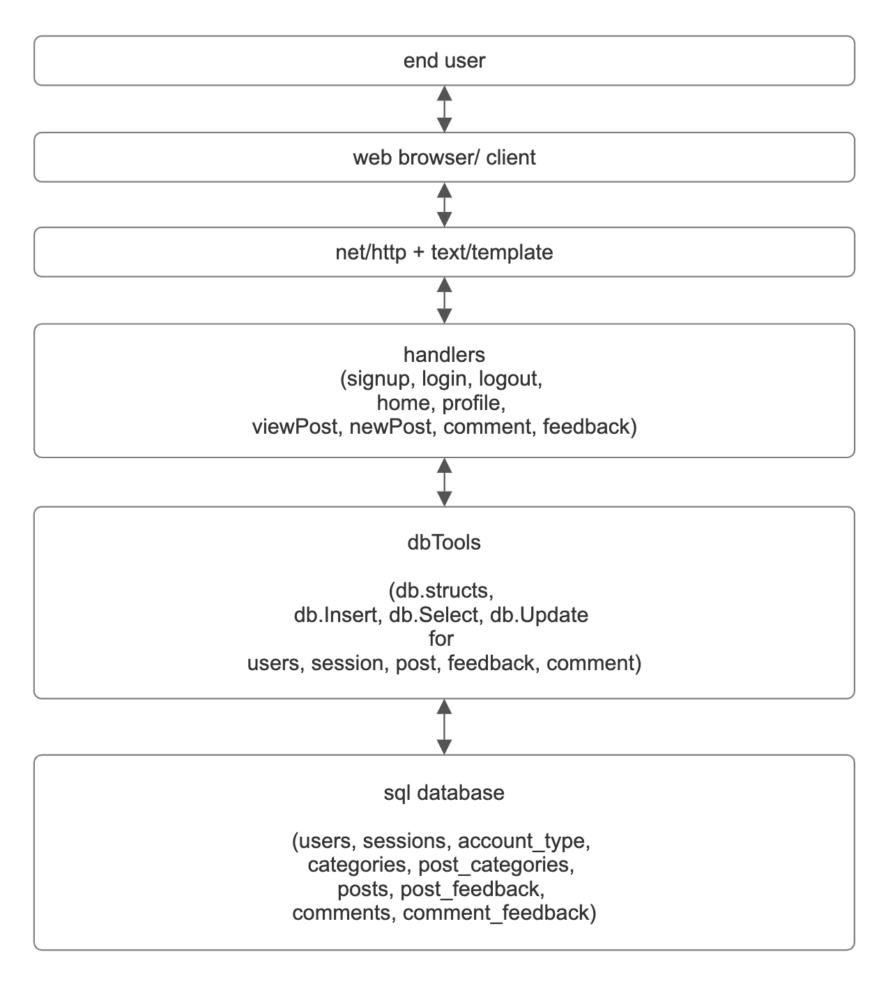
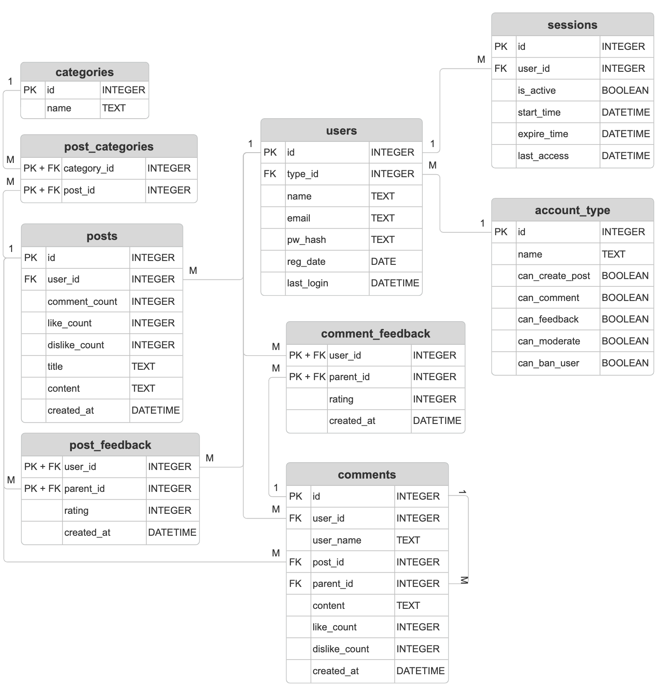

# Forum

A simple forum application with user accounts, posts, comments, and feedback functionality.

## Table of Contents

- [About](#about)
- [Usage](#usage)
- [Database Schema](#database-schema)
- [Installation](#installation)
- [Dependencies](#dependencies)
- [Pages](#pages)
- [Credits](#credits)

---

## About

This project is a **forum system** built in **Go**, using **SQLite** for lightweight and efficient data management. It allows users to:

- Create and manage **posts**
- Comment on discussions
- Provide feedback (like/dislike)
- Use session-based authentication
- Categorize posts into multiple topics

Below is a **Diagram** explaining the flow of data for this project:



---

## Usage

To use the forum application:

1. Register for an account or log in.
2. Create new posts and categorize them.
3. Comment on posts and engage in discussions.
4. Provide feedback by liking or disliking posts.
5. Browse discussions based on categories and trending topics.

---

## Database Schema

Below is a **Entity-Relationship Diagram (ERD)** for the forum database:



### **User**

- A user must have **one and only one** account type.
- A user can have **multiple sessions** but only **one active session**.
- A user can **create multiple posts**.
- A user can **provide multiple feedback**.

**Account Types:**

1. User
2. Moderator
3. Administrator

### **Post**

- A post must have **one author**.
- A post must have a **title** and **body**.
- A post can belong to **one or more categories**.
- A post keeps track of **comments and likes** for efficient querying.

### **Comment**

- A comment must have a **postId**.
- A comment can have **zero or one parentId**.
- Comments without a **parentId** are **root-level** comments.
- Comments with a **parentId** are **replies**.

### **Feedback**

- Feedback must have **one author**.
- Feedback must be associated with **one post**.

---

## Installation

To set up the forum locally, follow these steps:

```sh
# Clone the repository
git clone https://01.gritlab.ax/git/ylee/forum
cd forum

# Run the application
go run main.go
```

---

## Dependencies

This project requires the following Go dependencies:

- `github.com/gofrs/uuid v4.4.0+incompatible`
- `github.com/mattn/go-sqlite3 v1.14.24`
- `golang.org/x/crypto v0.32.0`

They'll automatically get installed when you run the project

---

## Pages

The forum includes the following pages:

- **Home** – Displays posts and trending discussions.
- **Login** – User authentication page.
- **Sign Up** – New user registration.
- **Profile** – User profile and settings.
- **New Post** – Create a new discussion thread.
- **View Post** – Read and interact with a specific post.
- **About** – Information about the forum.
- **Terms** – Forum terms and conditions.
- **Error** – Displays error messages.

---

## Credits

This project was developed by **Allen, Anass, Johannes, Milli, and Richard**.

