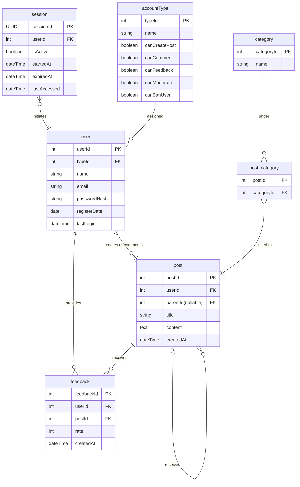

# forum

### SQLite
Below is an ER Diagram for the forum database.

accountType: 
- 1 user
- 2 moderator
- 3 administrator

user:
- A user must have one and only one account type
- A user can have mutliple sessions but only 1 active session.
- A user can creates multiple posts.
- A user can provide multiple feedback.

post:
- A post must have one and only one author
- A post with no parent post is treated as a topic post
- A post with parent is treated a comment post.
- A post can have multiple comments (children) but only 1 parent.
- A post must have at least one category, but can have multiple categories.
- A post can have multiple feedback.

feedback:
- A feedback must have one and only one author.
- A feedback must have one and only one post

### pages
- home page (guest/ user)
    - posts without parents (show number of comments and feedbacks)
    - filter by category, created, likes
    - sort by dateCreated, most likes, most comments
    - paginate posts?
- login
- register
- create post (must have at least one category)
- view post (show all comments and feedbacks for specified post)
    - paginate comments

### tasks
- create database
    - list down quries/commands used
    - indexing, required, and unique constraints
- create webpages
    - homepage
    - login
    - register
    - create post
    - view post (comments/feedback happens here)
- frontend logic
    - restriction for login and registration
    - restriction for multiple feedback for same post by one user
    - sorting
- backend logic
    - handler for home page (filtering)
    - handler for login (sessioId with UUID)
    - handler for registration (bycrpt)
    - handler for create post. check if valid sessionId
    - handler for view post
    - handler for (commenting/feedback). check if valid sessionId
    - handler for error
    - function to read database (SELECT query)
    - function to write data base (INSERT query)

### considerations
- https
- tracked invalid login for rate-limit
- session expiration logic
- deleting user, post, comment
- logging?
- share

