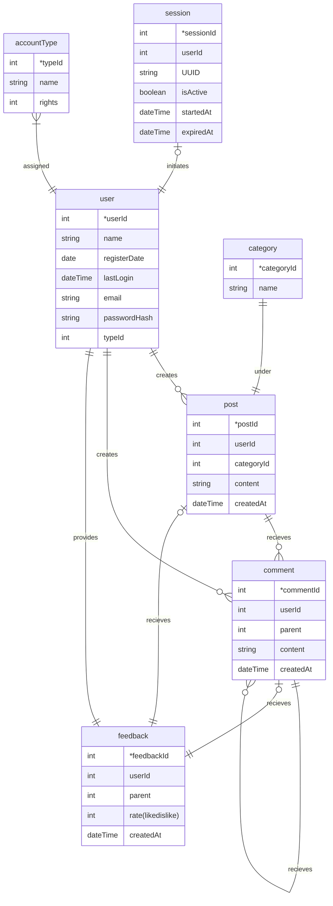

```mermaid
erDiagram
    user{
        int         *userId
        string      name
        date        registerDate
        dateTime    lastLogin
        string      email
        string      passwordHash
        int         typeId
    }

    post{
        int         *postId
        int         userId
        int         categoryId
        string      content
        dateTime    createdAt
    }

    comment{
        int         *commentId
        int         userId
        int         parent
        string      content
        dateTime    createdAt
    }

    feedback{
        int         *feedbackId
        int         userId
        int         parent
        int         rate(likedislike)
        dateTime    createdAt
    }
 
    category{
        int         *categoryId
        string      name
    }

    accountType{
        int         *typeId
        string      name
        int         rights
    }
    session{
        int         *sessionId
        int         userId
        string      UUID
        boolean     isActive
        dateTime    startedAt
        dateTime    expiredAt
    }

    session |o--|| user : "initiates"
    accountType }|--|| user : "assigned"
    user ||--o{ post : "creates"
    user ||--o{ comment : "creates"
    user ||--|| feedback : "provides"
    category ||--|| post : "under"
    post ||--o{ comment : "recieves"
    comment ||--o{ comment : "recieves"
    comment |o--|| feedback : "recieves"
    post |o--|| feedback : "recieves"
```
